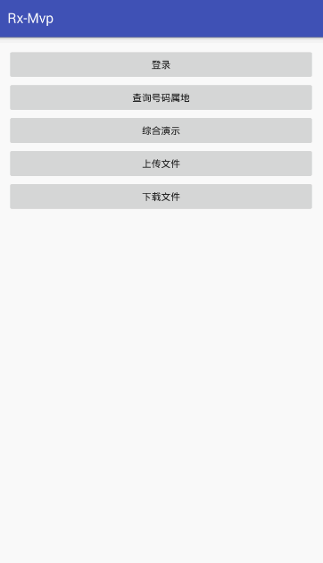

# Rx-Mvp

# 项目使用 RHttp + MVP 模式构建 #


## RHttp

> RHttp 是基于 RxJava2 + Retrofit2 + OkHttp3 + RxLifecycle2 框架整合封装的网络请求框架

- 基本的get、post、put、delete、4种请求
- 单/多文件上传 
- 断点续传下载
- 基本回调包含 onSuccess、onError、onCancel、onProgress（上传/下载）
- 支持自定义Callback
- 支持https
- 支持tag取消，也可取消全部   
- 支持链式调用
- 支持表单格式，String，json格式数据提交请求

RHttp 很屌吗？算不上，基本满足应用开发的所有需求，代码很简洁，体积小，功能齐全。这就够了

1. 基于主流网络框架 Retrofit2 + OkHttp3 作为底层框架
2. 使用 RxJava2 处理异步事件，线程间切换逻辑
3. 使用 RxLifecycle2 管理生命周期，再也不用担心 RxJava 使用不当造成内存泄漏
4. 基础网络请求，数据转换为 String 并提供 onConvert 方法提供开发者自定义转化数据
5. 上传带进度回调，多文件情况下，可以区分当前文件下标
6. 断点续传大文件，多种下载状态满足不同下载需求


```
        new RHttp.Builder()
                .post()                     //请求方式
                .apiUrl("user/login")       //接口地址
                .addParameter(parameter)    //参数
                .addHeader(header)          //请求头
                .lifecycle(this)            //自动管理生命周期，可以不传，如果未及时取消RxJava可能内存泄漏
                .build()
                .request(new HttpCallback<UserBean>() {
                    @Override
                    public UserBean onConvert(String data) {
                        /*数据解析转换*/
						//String 转为 Response（自定义）
                        Response response = new Gson().fromJson(data, Response.class);
						// Response 转为 JavaBean（目标对象）
                        UserBean userBean = new Gson().fromJson(response.getResult(), UserBean.class);
                        return userBean;
                    }

                    @Override
                    public void onSuccess(UserBean value) {
                        //do sth.
                    }

                    @Override
                    public void onError(int code, String desc) {
                        //do sth.
                    }

                    @Override
                    public void onCancel() {
  						//do sth.
                    }
                });
```

  


## [RHttp 使用 demo文档](https://github.com/RuffianZhong/Rx-Mvp/blob/master/RHttp_demo.md)

## [RHttp 详解文档](https://github.com/RuffianZhong/Rx-Mvp/blob/master/RHttp.md)


## MVP

> MVP 是 MVC 框架的升级版本，通过 Presenter 桥梁连接 View 和 Model，使得模块之间更好的解耦

#### MvpPresenter<V extends IMvpView>

```

/**
 * MVP  根Presenter
 */
public interface IMvpPresenter<V extends IMvpView> {

    /**
     * 将 View 添加到当前 Presenter
     */
    @UiThread
    void attachView(@NonNull V view);

    /**
     * 将 View 从 Presenter 移除
     */
    @UiThread
    void detachView();

    /**
     * 销毁 V 实例
     */
    @UiThread
    void destroy();

}


/**
 * MvpPresenter
 */
public class MvpPresenter<V extends IMvpView> implements IMvpPresenter<V> {

    /*View弱引用*/
    private WeakReference<V> viewRef;

    /**
     * 获取view
     *
     * @return
     */
    @UiThread
    public V getView() {
        return viewRef == null ? null : viewRef.get();
    }

    /**
     * 判断View是否已经添加
     *
     * @return
     */
    @UiThread
    public boolean isViewAttached() {
        return viewRef != null && viewRef.get() != null;
    }

    /**
     * 绑定View
     *
     * @param view
     */
    @UiThread
    @Override
    public void attachView(V view) {
        viewRef = new WeakReference<V>(view);
    }

    /**
     * 移除View
     */
    @Override
    public void detachView() {
        if (viewRef != null) {
            viewRef.clear();
            viewRef = null;
        }
    }

    @Override
    public void destroy() {
    }

}

```

#### Presenter使用

```
	class LoginPresenter extends MvpPresenter<ILoginView> {

	 /*登录逻辑*/
     public void login() {
		//loading	
		getView().mvpLoading(ACTION_LOGIN, true);

        new RHttp.Builder()
                .post()
                .apiUrl("user/login")
                .addParameter(parameterMap)
                .lifecycle(getActivity())
                .build()
                .request(new RHttpCallback<UserBean>() {
                    @Override
                    public UserBean convert(JsonElement data) {
                        return new Gson().fromJson(data, UserBean.class);
                    }

                    @Override
                    public void onSuccess(UserBean object) {
                        if (isViewAttached()) {
                            getView().mvpLoading(ACTION_LOGIN, false);
                            getView().mvpData(ACTION_LOGIN, object);
                        }
                    }

                    @Override
                    public void onError(int code, String desc) {
                        if (isViewAttached()) {
                            getView().mvpLoading(ACTION_LOGIN, false);
                            getView().mvpError(ACTION_LOGIN, code, desc);
                        }
                    }

                    @Override
                    public void onCancel() {
                        if (isViewAttached()) {
                            getView().mvpLoading(ACTION_LOGIN, false);
                        }
                    }
                });
    }
    }
```


#### MvpView
```

/**
 * IMvpView
 */
public interface IMvpView {
}


/**
 * 基础View接口
 * 备注:loading/data/error
 * 1. lde 思想: 页面通用  加载中/展示数据/错误处理
 * 2. action 方式: 考虑多个请求时 根据 action 区分处理
 */
public interface MvpView extends IMvpView {

    /**
     * mvp 加载中
     *
     * @param action 区分不同事件
     * @param show   开启/关闭 true:开启
     */
    @UiThread
    void mvpLoading(String action, boolean show);

    /**
     * mvp 展示数据
     *
     * @param action 区分不同事件
     * @param data   数据
     * @param <M>
     */
    @UiThread
    <M> void mvpData(String action, M data);

    /**
     * mvp 错误处理
     *
     * @param action 区分不同事件
     * @param code   错误码
     * @param msg    错误信息
     */
    @UiThread
    void mvpError(String action, int code, String msg);

}


/**
 * 登录view
 * 备注: MvpView 未能满足需求时新增方法
 */
public interface ILoginView extends MvpView {

    /**
     * 额外方法显示吐司
     *
     * @param msg
     */
    void showToast(String msg);

}
```

#### MvpActivity/MvpFragment

```
public abstract class MvpActivity<V extends IMvpView, P extends IMvpPresenter<V>> extends RxActivity
 implements IMvpView, MvpDelegateCallback<V, P> {

    /**
     * 获取 Presenter 数组
     */
    protected abstract P[] getPresenterArray();
}

```

```
 P[] getPresenterArray() 返回 Presenter 数组，可用于一个Activity 对应多个 Presenter 问题
```

#### Activity使用

```
    class XActivity extends MvpActivity implements ILoginView, IPhoneAddressView {
		
        //登录Presenter
        LoginPresenter loginPresenter = new LoginPresenter(this);
		//获取号码归属地	
    	PhoneAddressPresenter mPhonePst = new PhoneAddressPresenter(this);

        @Override
        protected void onCreate(@Nullable Bundle savedInstanceState) {
            super.onCreate(savedInstanceState);
            loginPresenter.login();
			mPhonePst.query();
        }

        @Override
	    protected IMvpPresenter[] getPresenterArray() {
	        return new IMvpPresenter[]{mLoginPresenter, mPhonePst};
	    }
	
	    @Override
	    public void showToast(String msg) {
	        ToastUtils.showToast(mContext, msg);
	    }
	
	    @Override
	    public void mvpLoading(String action, boolean show) {
	        /**
	         * 区分action  只有action是登录业务时才需要loading  （根据开发者具体业务需求实现）
	         */
	        if (GlobalConstants.ACTION_LOGIN.equals(action)) {
	            if (show) {
	                mLoadingDialog.show();
	            } else {
	                mLoadingDialog.dismiss();
	            }
	        }
	    }
	
	    @Override
	    public <M> void mvpData(String action, M data) {
	        if (GlobalConstants.ACTION_LOGIN.equals(action)) {//登录返回数据
	            UserBean bean = (UserBean) data;
	            setupUserInfo(bean);
	        } else if (GlobalConstants.ACTION_QUERY_PHONE.equals(action)) {//号码查询返回数据
	            PhoneAddressBean bean = (PhoneAddressBean) data;
	            setupPhoneInfo(bean);
	        }
	    }
	
	    @Override
	    public void mvpError(String action, int code, String msg) {
	        /**
	         * 具体业务具体分析，这里不需要根据action或者code做特殊处理，因此一并吐司提示
	         */
	        showToast(msg);
	    }
    }
```


```
   /**
     * 文档说明有限
     *
     * 强烈建议阅读代码，在此基础上改造成适用自己项目的框架
     *
     * 欢迎提供建议/意见，不断完善框架
     *
     * 喜欢就start吧，收获知识激励别人
     */

```


## License

```
MIT License

Copyright (c) 2018 Ruffian-痞子

Permission is hereby granted, free of charge, to any person obtaining a copy
of this software and associated documentation files (the "Software"), to deal
in the Software without restriction, including without limitation the rights
to use, copy, modify, merge, publish, distribute, sublicense, and/or sell
copies of the Software, and to permit persons to whom the Software is
furnished to do so, subject to the following conditions:

The above copyright notice and this permission notice shall be included in all
copies or substantial portions of the Software.

THE SOFTWARE IS PROVIDED "AS IS", WITHOUT WARRANTY OF ANY KIND, EXPRESS OR
IMPLIED, INCLUDING BUT NOT LIMITED TO THE WARRANTIES OF MERCHANTABILITY,
FITNESS FOR A PARTICULAR PURPOSE AND NONINFRINGEMENT. IN NO EVENT SHALL THE
AUTHORS OR COPYRIGHT HOLDERS BE LIABLE FOR ANY CLAIM, DAMAGES OR OTHER
LIABILITY, WHETHER IN AN ACTION OF CONTRACT, TORT OR OTHERWISE, ARISING FROM,
OUT OF OR IN CONNECTION WITH THE SOFTWARE OR THE USE OR OTHER DEALINGS IN THE
SOFTWARE.
```