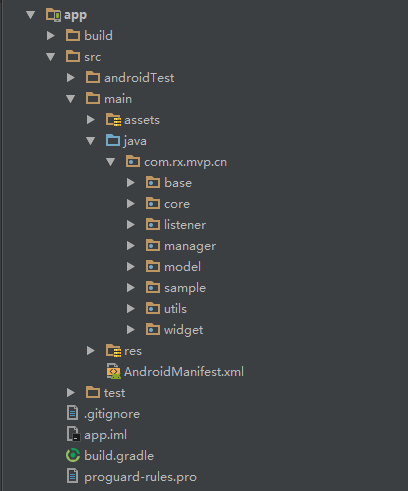
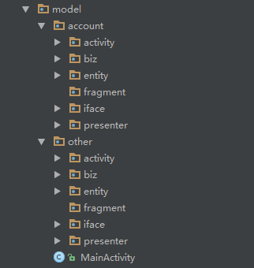

# Rx-Mvp

# RxJava2+Retrofit2+RxLifecycle2使用MVP模式构建项目 #

## 项目包结构

 

  

> base： 一些基础封装类
> 
> core：核心代码 { net(http,socket)-网络 / db-数据库 / bitmap-图片 / view-控件/视图   } 
> 
> model：业务模块 { activity / fragment / presenter / biz-业务处理类 / entity-实体类 / iface-view接口  } 
>        
> sample：各种使用说明，方便项目维护和新人熟悉  eg: httpSample-http请求框架使用示例
> 
> utils：各种工具类
> 
> widget：控件（自定义控件/第三方开源控件）
> 

## RxJava2+Retrofit2+RxLifecycle2

## Api接口 ##
    public interface Api {
	    /**
	     * GET请求
	     *
	     * @param url     api接口url
	     * @param request 请求参数map
	     * @return
	     */
	    @GET
	    Observable<HttpResponse> get(@Url String url, @QueryMap TreeMap<String, Object> request);

	    /**
	     * POST请求
	     *
	     * @param url     api接口url
	     * @param request 请求参数map
	     * @return
	     */
	    @FormUrlEncoded
	    @POST
	    Observable<HttpResponse> post(@Url String url, @FieldMap TreeMap<String, Object> request);
	}

## 定义View接口 ##
    public interface ILoginView extends IBaseView {

	    //显示结果
	    void showResult(UserBean bean);

	}

> 这里有部分开发者可能会认为把 `UserBean` 实体传递给 `View(activity/fragment)` 还是会出现 `model` 跟 `view` 的耦合
> 
> 个人认为，不一定死脑筋非要完全解耦才是实现了 `MVP` 的模式，这里已经实现了不关心 `UserBean` 的来源和构建方式就可以了
> 
> ** # ** 如果非要完全解耦也是可以的 `void showResult(String userName,int userId....)` 要用几个参数就定义几个参数，但是感觉太麻烦了 ** # **
> 

## Request 请求使用方法 ##
    /**
     * 用户登录
     *
     * @param userName
     * @param password
     * @param lifecycle
     * @param callback
     */
    public void login(String userName, String password, LifecycleProvider lifecycle, HttpRxCallback callback) {
        /**
         * 构建请求参数
         */
        TreeMap<String, Object> request = new TreeMap<>();
        request.put("username", userName);
        request.put("password", password);
        request.put(HttpRequest.API_URL, "user/login");

        /**
         * 解析数据
         */
        callback.setParseHelper(new ParseHelper() {
            @Override
            public Object[] parse(JsonElement jsonElement) {
                UserBean bean = new Gson().fromJson(jsonElement, UserBean.class);
                Object[] obj = new Object[1];
                obj[0] = bean;
                return obj;
            }
        });

        /**
         * 发送请求
         */
        new HttpRequest().request(HttpRequest.Method.POST, request, lifecycle, callback);

    }

### 接口地址动态设置 ###

> 
> 构建参数时设置 `HttpRequest.API_URL` 接口名称/路径 等价于: `baseUrl + HttpRequest.API_URL`
> 
> `http://apicloud.mob.com/ (baseUrl)`  ** + ** ` user/login (HttpRequest.API_URL指定的值)`

### request 请求方法 ###
     /**
     * 发送请求
     * 备注:不管理生命周期
     *
     * @param method   请求方式
     * @param prams    参数集合
     * @param callback 回调
     */
    public void request(HttpRequest.Method method, TreeMap<String, Object> prams, HttpRxCallback callback)

    /**
     * 发送请求
     * 备注:自动管理生命周期
     *
     * @param method    请求方式
     * @param lifecycle 实现RxActivity/RxFragment 参数为空不管理生命周期
     * @param prams     参数集合
     * @param callback  回调
     */
    public void request(HttpRequest.Method method, TreeMap<String, Object> prams,
						LifecycleProvider lifecycle, HttpRxCallback callback)

    /**
     * 发送请求
     * 备注:手动指定生命周期-Activity
     *
     * @param method    请求方式
     * @param lifecycle 实现RxActivity
     * @param event     指定生命周期
     * @param prams     参数集合
     * @param callback  回调
     */
    public void request(HttpRequest.Method method, TreeMap<String, Object> prams, 
						LifecycleProvider<ActivityEvent> lifecycle, ActivityEvent event, HttpRxCallback callback)    

## Presenter 中使用 ##
    public class LoginPresenter extends BasePresenter<ILoginView, LoginActivity> {

    	private final String TAG = PhoneAddressPresenter.class.getSimpleName();

	    public LoginPresenter(ILoginView view, LoginActivity activity) {
	        super(view, activity);
	    }

	    public void login(String userName, String password) {
	
	        if (getView() != null)
	            getView().showLoading();
	
	        HttpRxCallback httpRxCallback = new HttpRxCallback(TAG + "login") {
	            @Override
	            public void onSuccess(Object... object) {
	                if (getView() != null) {
	                    getView().closeLoading();
	                    getView().showResult((UserBean) object[0]);
	                }
	            }
	
	            @Override
	            public void onError(int code, String desc) {
	                if (getView() != null) {
	                    getView().closeLoading();
	                    getView().showToast(desc);
	                }
	            }

	            @Override
	            public void onCancel() {
	                if (getView() != null) {
	                    getView().closeLoading();
	                }
	            }
	        };
	
	        new UserBiz().login(userName, password, getActivity(), httpRxCallback);
	
	        /**
	         * ******此处代码为了测试取消请求,不是规范代码*****
	         */
	        /*try {
	            Thread.sleep(50);
	            //取消请求
	            if (!httpRxCallback.isDisposed()) {
	                httpRxCallback.cancel();
	            }
	        } catch (InterruptedException e) {
	            e.printStackTrace();
	        }*/
	    }
	}
 

> 通常情况下使用 `LifecycleProvider` 自动管理生命周期就不需要手动取消请求
> 
> 如果在特殊场景需要开发者取消请求则使用 `httpRxCallback.cancel()`

     /**
     * 文档说明有限
     *
     * 强烈建议阅读代码，在此基础上改造成适用自己项目的框架
     *
     * 欢迎提供建议/意见，不断完善框架
     */

原始构造想法参考博客

**CSDN博客地址：http://blog.csdn.net/u014702653/article/details/75268919**